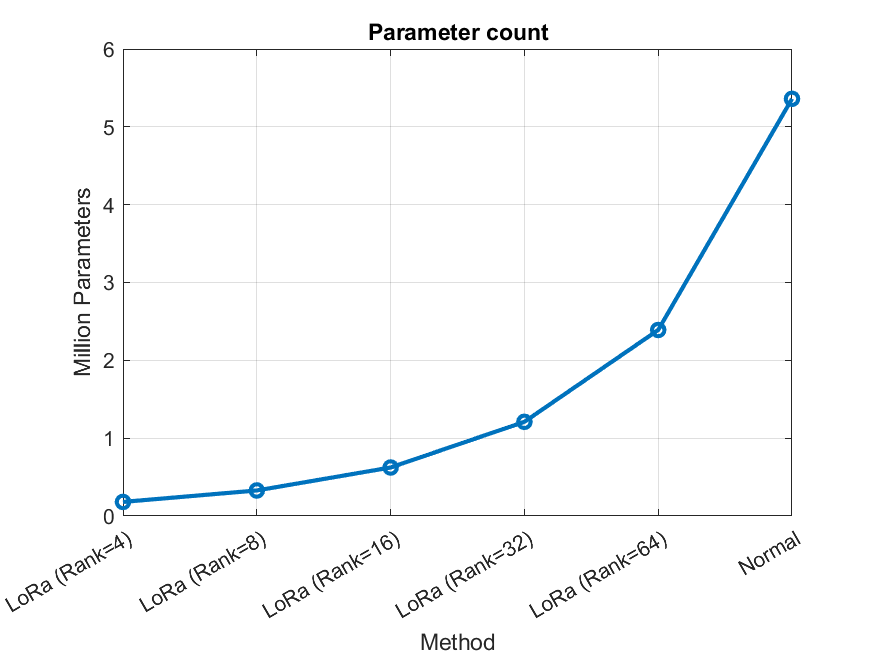
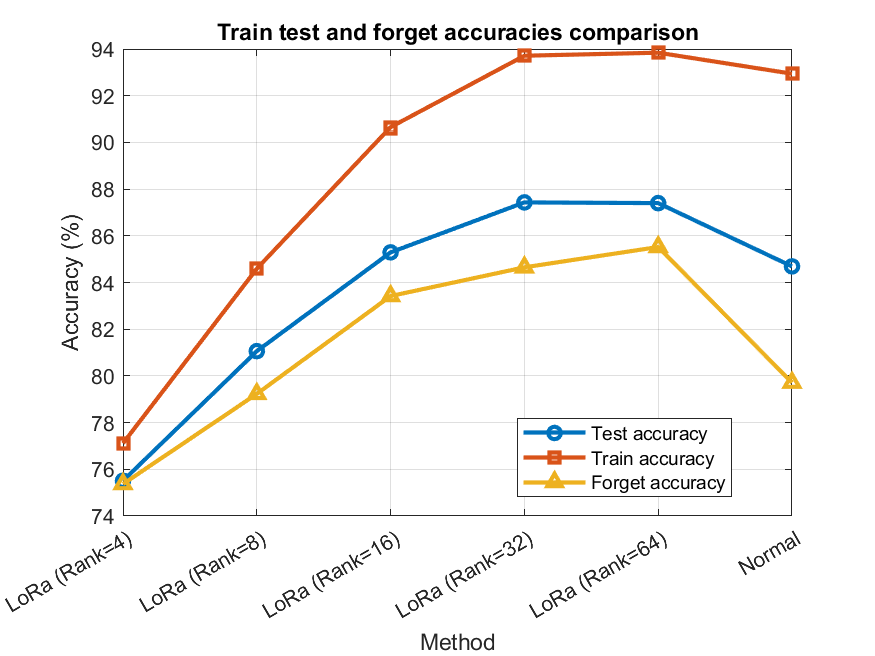
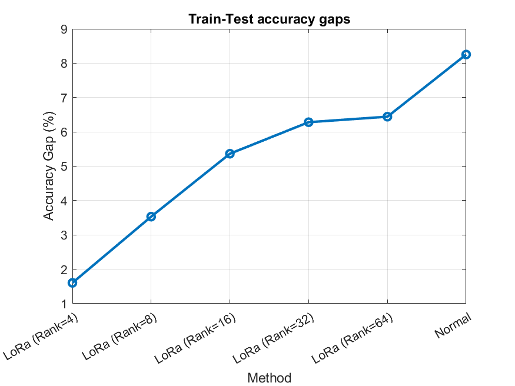
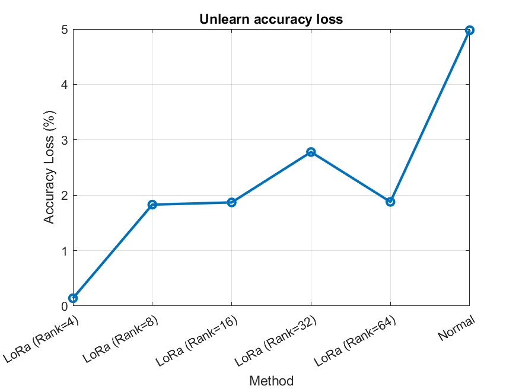
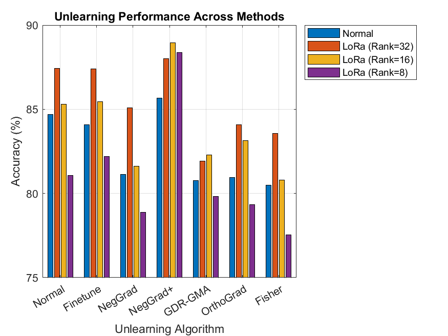
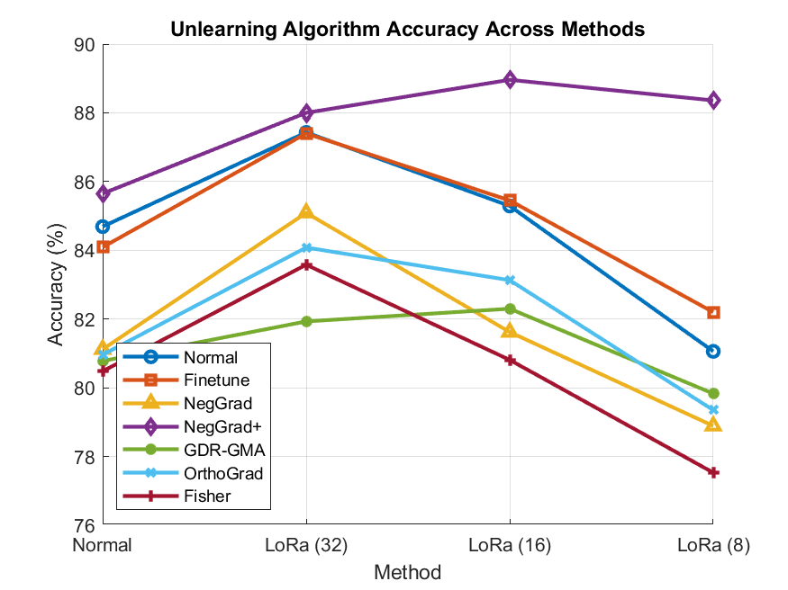

# DP Unlearning
This repository is part of a research on using differential privacy to achieve a model that better recovers from unlearning, this research suggests the following training method:
1. Training the model using diffential privacy to obtain a model with similar train and test accuracy.
2. Fine-tune the differentialy private model on a small amount of parameters, that way storing critical information/remembering the dataset in a small amount of parameters.
When we want to unlearn a specific forget set in the dataset, we unlearn only the on specific parameters that were trained in the fine-tuning process, which will hopefully hurt the model's accuracy less when unlearning.

## Stage 1
In the first stage of this research we want to get the highest accuracy model trained with this method.
We have tested 2 models:
- A variant of Resnet18 using group norm instead of batch norm as batch norm isn't allowed in differential privacy, and weight standardization on each convolutional layer that is followed by a normalization layer.
-  ViT-Tiny, a small transformer model with width 4 and depth 12.
The models were all trained on the CIFAR10 dataset, first normally, then with differential privacy, and then fine-tuned on the DP model with different methods.
The following table shows the accuracies achieved with the different methods tried:

### Resnet18
| Method | Parameters | Test accuracy | Train accuracy |
|---|---|---|---|
| Normal | 11.2M | 89.76 | 98.94 |
| DP | 11.2M | 68.13 | 68.91 |
| Conv Adapter | 1.7M | 88.09 | 95.26 |
| LoRa | 1.5M | 85.95 | 92.15 |
| Channel Pruning | 1.4M | 85.73  | 91.93 |

### ViT-Tiny
| Method | Trained on | Parameters | Test accuracy | Train accuracy |
|---|---|---|---|---|
| Normal | X | 5.6M | 88.02 | 99.8 |
| DP | X | 5.6M | 47.42 | 48.90 |
| LoRa (Rank=16) | X | 0.6M | 87.73 | 95.13 |
| LoRa (Rank=8) | DP | 0.3M | 84.91 | 90.66 |
| LoRa (Rank=16) | DP | 0.6M | 87.55 | 95.76 |
| LoRa (Rank=32) | DP | 1.2M | 88.23 | 96.83 |

### WRN-16-4
Wide Resnet of depth 16 and width 4.
All unlearning tasks where done with the same epoch budget (30 epochs), using NegGrad+ until test and forget accuracies where the same.

| Method | Trained on | Parameters | Test accuracy | Train accuracy | Random Forget 1000 | Comment |
|---|---|---|---|---|---|---|
| Normal | | 2.75M | 91.04 | 99.89 | 67.28 | |
| DP (eps=8) | | 2.75M | 69.12 | 70.4 | | Trained with augmentation multiplicity 4, and batch size 2048. The paper "Unlocking High-Accuracy Differentially
Private Image Classification through Scale" suggests using AM 16 and BS 4096 to achieve ~79 accuracy (runtime becomes to high). |
| LoRa (Rank=16) | | 244K | 88.58 | 94.756 | 84.94 | |
| LoRa (Rank=8) | DP (eps=8) | 125K | 86.46 | 91.412 | 84.55 | |
| LoRa (Rank=16) | DP (eps=8) | 244K | 88.92 | 95.548 | 84.71 | |
| LoRa (Rank=32) | DP (eps=8) | 482K | 90.21 | 98 | 83.49 | |
| Conv-Adapter | DP (eps=8) | 453K | 88.74 | 97.364 | | First block fully trained, second has 1/4 channels and last has 1/16 channels. |
| DP (eps=8) LoRa (Rank=16) | | 244K | 89.18 | 94.712 | | DP trained with both original and lora weights, then finetuned only on lora weights |

### PEFT on larger model vs smaller model

| Model | Method | Parameters | Test accuracy |
|---|---|---|---|
| ViT-Tiny | Normal | 5.36M | 86.03 |
| ViT-Small | Lora(rank=16) | 1.24M | 87.83 |
| ViT-Small | Lora(rank=32) | 2.42M | 88.78 |
| ViT-Small | Lora(rank=64) | 4.78M | 89.24 |

## Stage 2
Test unlearning (until test and forget set accuracies are the same) the original model against the new method, compare both test accuracies, hopefully achieving higher accuracy on the new method.

### ViT-Base
#### Notes
- The pretrained model refers to ViT-Base with input size 224, trained on ImageNet, thus in the following training Cifar10 images were resized from size 32 to 224.
- Each model was trained for 5 epochs which means the models are not fully converged but close.
- Train accuracies are not exact as they were captured mid training while the models weights were still changing.

#### Results

| Method | Trained on | Parameters | Test accuracy | Train accuracy | Comment |
|---|---|---|---|---|---|
| Normal | pretrained | 85.8M | 99.02 | 99.9 | |
| DP (eps=8) | pretrained | 85.8M | 97.8 | 98.45 | |
| DP (eps=3) | pretrained | 85.8M | 97.57 | 98.22 | |
| DP (eps=2) | pretrained | 85.8M | 97.5 | 98.14 | |
| DP (eps=1) | pretrained | 85.8M | 97.32 | 97.85 | |
| LoRa (Rank=2-64) | DP (eps=1) and pretrained | 1M - 10M | 98.7 - 98.85 | | Power of 2 rank from 2 to 64 LoRa on attention and MLP linear layers |
| LoRa (Rank=4, 1) | DP (eps=1) | 0.65M | 98.77 | 99.7 | rank 4 LoRa on attention and MLP linear layers and rank 1 out of 3 on convolutional patch embedding |

#### Conclusions
- LoRa failed to achieve higher accuracies for higher ranks, also choosing the DP model as a starting point didn't move this barrier.
- The use of pretrained models allowed high accuracy for both LoRa with low ranks and differential privacy with low epsilons.
- The accuracy of the model is barely hurt with less then 1% of the original parameters.

#### Unlearning
Both the Normal model and the LoRa (Rank=4, 1) model were unlearned using the NegGrad+ algorithm (descent on the retain and ascent on the forget) until the accuracy on the forget set equaled the accuracy on the test set. Remarkably the LoRa model ended up with a test set accuracy of 98.21, notably higher then the test set accuracy on the normal model of 97.66

### Lora research
In this stage we minimize the amount of parameters across different sizes of the ViT model using LoRa with different ranks, we then see the effects of those changes on model train and test accuracy, the accuracy gap, and the effect on the efficiency on unlearning tasks.

The following are test accuracies of different models with different parameter counts, trained on the CIFAR10 dataset for 100 epochs:

| Model \ Method | LoRa (Rank=8) | LoRa (Rank=16) | LoRa (Rank=32) | Normal |
|---|---|---|---|---|
| ViT-Tiny | 81.06 | 85.29 | 87.43 | 84.69 |
| ViT-Small | 81.81 | 86.24 | 88.14 | 87.98 |
| ViT-Base | 85.65 | 88.00 | 88.96 | 88.36 |

The following are test accuracies of different models with different parameter counts, after performing unlearning on a random set of size 1000 with an epoch budget of 8 with the NegGrad+ algorithm:

| Model \ Method | LoRa (Rank=8) | LoRa (Rank=16) | LoRa (Rank=32) | Normal |
|---|---|---|---|---|
| ViT-Tiny | 79.23 | 83.42 | 84.65 | 79.71 |
| ViT-Small | 81.65 | 84.57 | 85.78 | 78.57 |
| ViT-Base | 78.47 | 78.07 | 78.13 | 80.36 |

Additional data on ViT-Tiny:

Figure 1 | A plot showing parameter count in millions for each training method.

Figure 2 | A plot showing train, test and forget (model unlearning task) accuracies.

Figure 3 | A plot showing train-test accuracies gap.

Figure 4 | A plot showing the loss of accuracy after an unlearning task.

#### GDR-GMA
Here we proceed with comparing unlearning tasks on our previous models but using a "better" algorithm.

For reference, the following are test accuracies of different models with different parameter counts, trained on the CIFAR10 dataset for 100 epochs:

| Model \ Method | LoRa (Rank=8) | LoRa (Rank=16) | LoRa (Rank=32) | Normal |
|---|---|---|---|---|
| ViT-Tiny | 81.06 | 85.29 | 87.43 | 84.69 |
| ViT-Small | 81.81 | 86.24 | 88.14 | 87.98 |
| ViT-Base | 85.65 | 88.00 | 88.96 | 88.36 |

The following are test accuracies of different models with different parameter counts, after performing unlearning on a random set of size 10000 with an epoch budget of 4 with the GDR-GMA algorithm:

| Model \ Method | LoRa (Rank=8) | LoRa (Rank=16) | LoRa (Rank=32) | Normal |
|---|---|---|---|---|
| ViT-Tiny | 79.83 | 82.3 | 81.93 | 80.78 |
| ViT-Small | 79.6 | 82.27 | 83.55 | 80.42 |
| ViT-Base | 80.69 | 82.88 | 81.54 | 79.46 |

Additionally ViT-Tiny using LoRa (Rank=4) achieved 75.79% accuracy and with LoRa (Rank=64) 83.23% accuracy.
The following are unlearning results like above but when performing the task on the base model architecture instead of using LoRa (that is taking the LoRa weights and adding them to the original weights, and then removing the LoRa weights):

| Model \ Method | LoRa (Rank=8) | LoRa (Rank=16) | LoRa (Rank=32) |
|---|---|---|---|
| ViT-Tiny | 80.37 | 83.2 | 84.23 |

In this setup, using LoRa (rank=16) to unlearn the "Normal" ViT-Tiny model achieved a worse accuracy then the original setup. Also Using a ViT-Tiny model pre-trained with DP (epsilon=8) and then fine-tuned using LoRa (rank=16) for unlearning, achieved worse accuracy then the original setup (ViT-Tiny Lora (Rank=16) unlearning).

#### Unlearning Algorithms ViT-Tiny
Random samples forgetting on different parameter counts with different unlearning algorithms:

| Unlearning algorithm \ Method | Normal | LoRa (Rank=32) | LoRa (Rank=16) | LoRa (Rank=8) |
|---|---|---|---|---|
| Normal | 84.69 | 87.43 | 85.29 | 81.06 |
| Finetune | 84.09 | 87.40 | 85.45 | 82.20 |
| NegGrad | 81.12 | 85.09 | 81.62 | 78.89 |
| NegGrad+ | 79.71 | 84.65 | 83.42 | 79.23 |
| GDR-GMA | 80.78 | 81.93 | 82.3 | 79.83 |
| OrthoGrad | 80.96 | 84.08 | 83.13 | 79.35 |
| Fisher | 80.48 | 83.58 | 80.81 | 77.53 |

- Fisher and NegGrad are run until forget accuracy reaches original test accuracy instead of live test accuracy.
- GDR-GMA is run on 10000 samples instead of a 1000.
- Finetune runs 20 epochs on retain set.
- OrthoGrad is run with mean gradient accumulation instead of per sample.

Figure 5 | A bar chart showing the test accuracies of ViT-Tiny on different parameter counts with different unlearning algorithms.

Figure 6 | A plot chart showing the test accuracies of ViT-Tiny on different parameter counts with different unlearning algorithms.